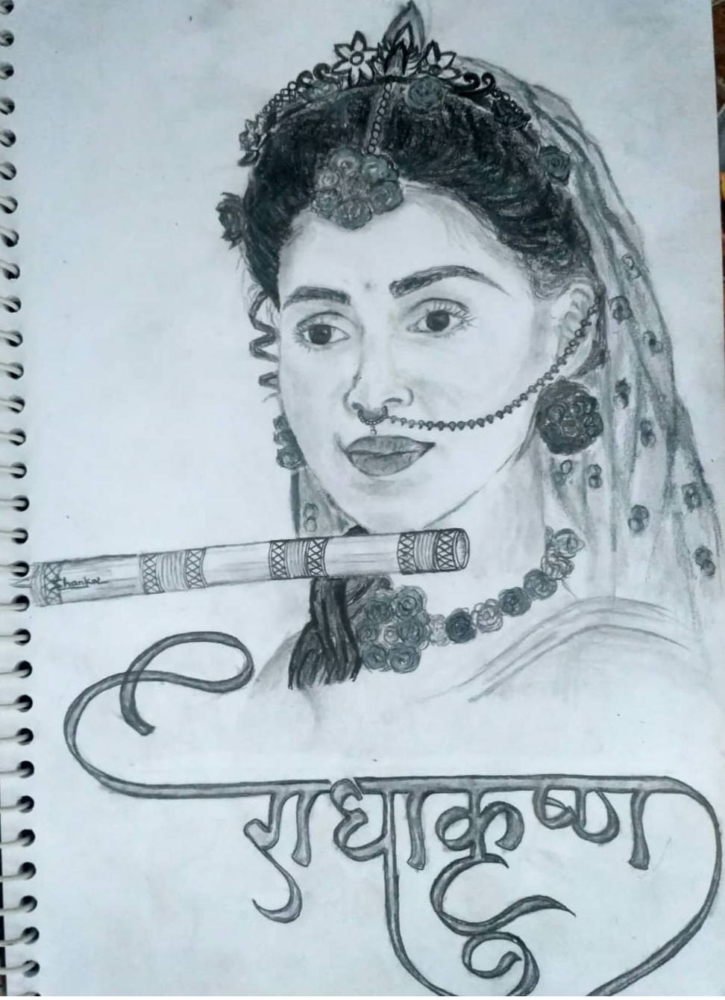

<!-- Add a stylish banner or image here -->
<div align="center" style="border-radius: 20px; overflow: hidden;">
  
</div>


# Hi there 👋I'm Rathod Shanker
####   NITW'26 MCA Student | Former Senior Analyst at Cognizant | Full-Stack Developer | Data & Tech Enthusiast |Sketch Artist 🎨


Welcome to my portfolio! I'm Rathod Shanker, a tech enthusiast and a Full-Stack Developer currently pursuing my Postgraduate 🎓 degree at NIT Warangal. I bring code to life while expressing my creativity through sketches🎨. I'm passionate about Full Stack development and take pride in writing clean and efficient code. Welcome to my GitHub repository! <be> 
<br>
[Portfolio👨‍💻](https://shankar212.github.io/Myportfolio/portfolio)

<details>
<summary>More About Me</summary>

## 🚀 Skills
- **Full-stack Java Development**
- **Front-end Development (HTML, CSS, Bootstrap, JavaScript)**
- **Back-end Development (CPP, Java, Spring Boot, AngularJS)**
- **Database Management (MySQL)**
- **Problem Solving**
- **Clean and Efficient Code Writing**

## 🎨 Hobbies
I am not just a developer; I am also passionate about sketching. Here are some of my sketch artworks:

<div style="display: flex; justify-content: center; align-items: center;">
  
  
  
</div>
<hr>

## 🌟 Projects

Here are some of my notable projects:

## 1. **College Management System** - [Live Demo](https://github.com/shankar212/FinalCms)
   

A College Management System is a web-based application designed to streamline administrative tasks in educational institutions.

## Technologies Used

- **Backend:** Java, Spring Boot, Maven, MySQL
- **Frontend:** Angular, HTML, JavaScript (ES6)
- **Version Control:** Git, GitHub

## Features

- Student Management
- Faculty Management
- Staff Management
- Faculty and Staff Management
- Academic Performance 
- Student Report
- Fee Collection
- User-Friendly Interface
- Data Security

## Demo

Check out the [Live Demo](https://github.com/shankar212/FinalCms) to see the system in action.

## Getting Started

Follow these steps to run the project locally:

1. Clone the repository:

   ```bash
   git clone https://github.com/shankar212/FinalCms.git
   cd FinalCms
<hr>


## 2.**Faculty Management System** - [Live Demo](https://github.com/shankar212/FacultyManagement)
 

A Faculty Management system designed to simplify faculty-related tasks within an educational institution.

## Live Demo

Explore the repo to see the system in action.

## Features

- Faculty Information Management
- Schedule Management
- Faculty Performance Tracking
- User-Friendly Interface
- Data Security

## Getting Started

1. Clone the repository:

   ```bash
   git clone https://github.com/shankar212/FacultyManagement.git
   cd FacultyManagement

<hr>

## 3.**My Portfolio** - [GitHub Repo](https://github.com/shankar212/Myportfolio)
   - Portfolio live : https://shankar212.github.io/Myportfolio/portfolio#experience

   - I designed and implemented this project from the ground up, taking a hands-on approach to every aspect of development. It showcases my expertise in web development, particularly in using HTML, CSS, JavaScript, and other relevant technologies. The project's codebase is well-organized and follows best practices, making it easily maintainable and scalable.

</details>

## 📬 Contact
Feel free to reach out to me via email at [shankerr7780@gmail.com](mailto:shankerr7780@gmail.com) or connect with me on [LinkedIn](https://www.linkedin.com/in/rathod-shanker-4a609421b/). [Instagram](https://www.instagram.com/shanker_rathodd/).

<!-- Add any additional sections or information you'd like to include -->
